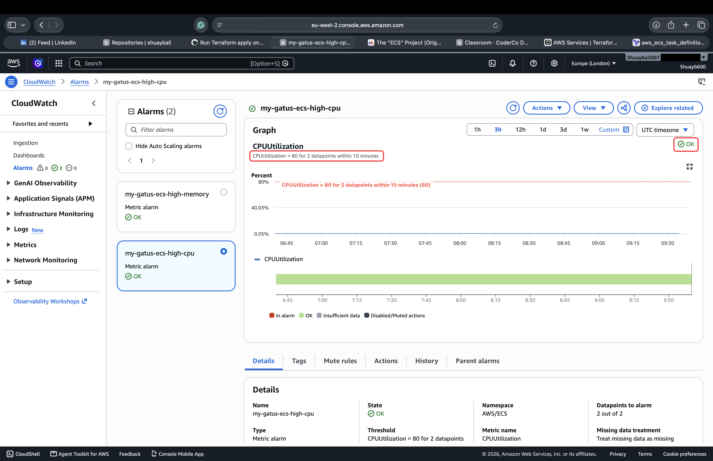
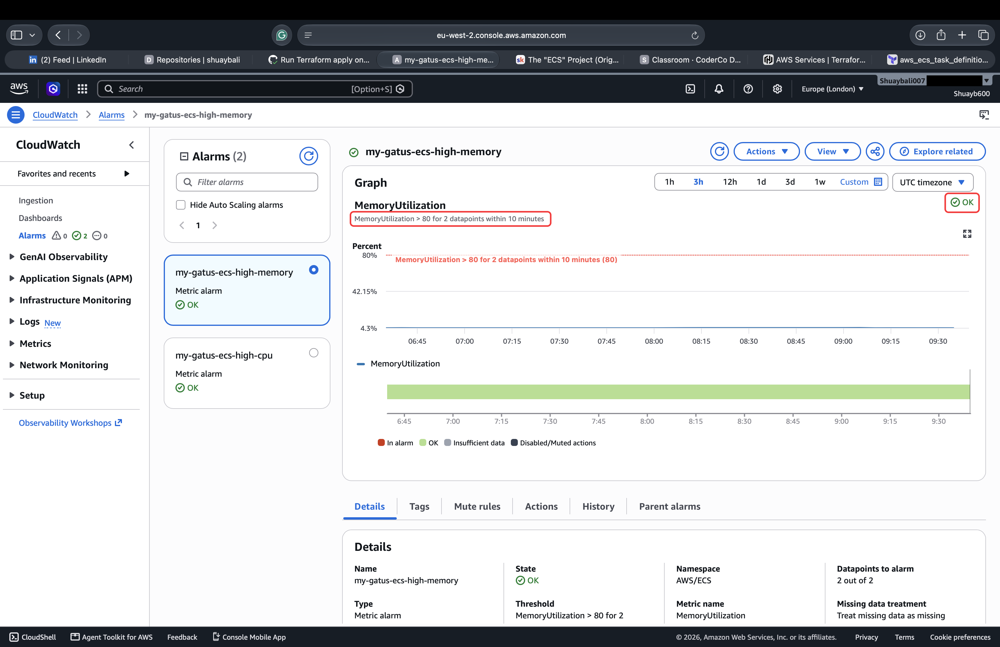
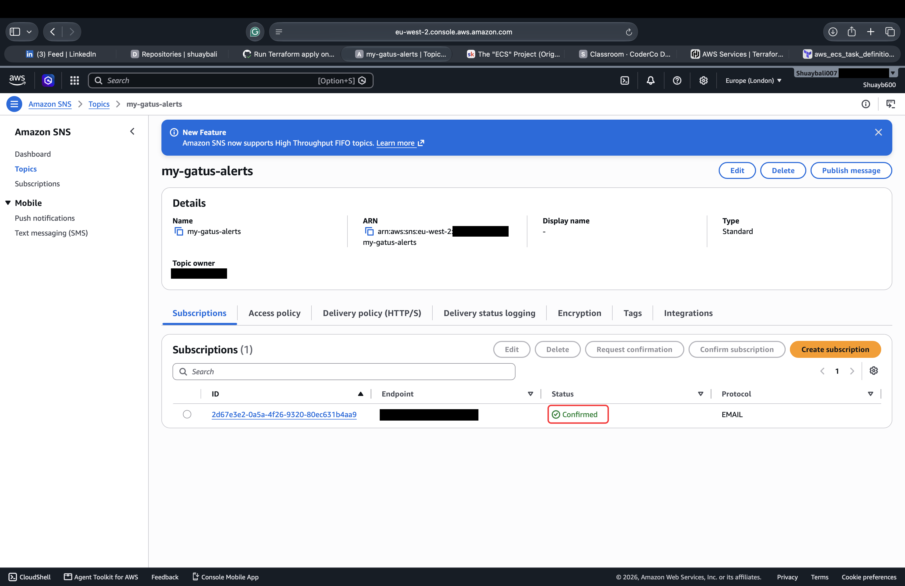

# Gatus ECS Deployment

A production-style deployment of [Gatus](https://github.com/TwiN/gatus) on **Amazon ECS Fargate**, provisioned with **Terraform** and automatically deployed using **GitHub Actions**.

The project covers the full deployment lifecycle: containerisation, AWS infrastructure, Infrastructure as Code, CI/CD, HTTPS, monitoring, and secure AWS authentication using OIDC.

**Application:** <https://tm.shuaybali.com>

## Overview

Gatus runs as a minimal ARM64 Docker container on ECS Fargate behind an Application Load Balancer, with Route 53 and ACM providing custom DNS and HTTPS.

The infrastructure is managed through modular Terraform with an S3 remote backend and state locking, while separate GitHub Actions workflows manage infrastructure changes and application deployments.

Key features include:

- Multi-stage `scratch` Docker image
- Amazon ECS Fargate and ECR
- Application Load Balancer with HTTP → HTTPS redirect
- Route 53 and ACM
- Modular Terraform with remote state and locking
- GitHub Actions with AWS OIDC authentication
- Commit SHA image tagging and automated ECS deployments
- Post-deployment `/health` verification
- CloudWatch monitoring with SNS alerts

## Architecture

The application runs on Amazon ECS Fargate across a multi-AZ network, behind an Application Load Balancer with HTTPS provided by ACM and Route 53.


## Tech Stack

| Area                   | Technologies                             |
| ---------------------- | ---------------------------------------- |
| Application            | Gatus v5.7.0                             |
| Containerisation       | Docker, Buildx, ARM64                    |
| Cloud                  | AWS ECS Fargate, ECR, ALB, Route 53, ACM |
| Infrastructure as Code | Terraform, S3 Remote Backend             |
| CI/CD                  | GitHub Actions, AWS OIDC                 |
| Monitoring             | CloudWatch, SNS                          |
| Security               | IAM, Security Groups, HTTPS              |
| Quality                | Terraform fmt, validate, TFLint          |

## Infrastructure & Terraform

The AWS infrastructure is provisioned using **Terraform** and organised into reusable modules for clear separation of responsibilities.

Terraform provisions:

- Custom VPC with public and private subnets structured across two Availability Zones
- Application Load Balancer with HTTP → HTTPS redirect
- ECS Fargate cluster, service and task definition
- Amazon ECR repository
- Route 53 DNS record and ACM certificate
- IAM task execution and task roles
- Security groups for ALB and ECS traffic
- CloudWatch logging, CPU/memory alarms and SNS notifications

Terraform state is stored remotely in **Amazon S3** with state locking, allowing the same state to be safely used by both local Terraform commands and GitHub Actions.

Infrastructure changes are validated with `terraform fmt`, `terraform validate` and `tflint` before a plan is generated. Changes pushed to `main` are then automatically applied through the Terraform GitHub Actions workflow.

## CI/CD

Three GitHub Actions workflows isolate application deployment, infrastructure management, and controlled teardown. All AWS authentication is securely negotiated via **OpenID Connect (OIDC)**, eliminating the need for long-lived IAM access keys.

### Application Deployment

Triggered automatically by changes to the `GatusApp/` directory or invoked manually:

1. Builds the minimal multi-stage `scratch` Docker image for `linux/arm64` using QEMU and Buildx.
2. Tags the image with the unique Git commit SHA and pushes it to Amazon ECR.
3. Registers a new ECS task definition revision and deploys it to the Fargate service.
4. Monitors deployment events until the ECS service reaches stability.
5. Performs a live HTTP verification against the production `/health` endpoint to confirm success.

### Terraform Infrastructure

Triggered automatically by changes to the `terraform/` directory or invoked manually:

`fmt ──► init ──► validate ──► TFLint ──► plan ──► apply`

- **Pull Requests:** Execute formatting check, initialization, validation, linting, and generate a `terraform plan`.
- **Pushes to main:** Execute the full lifecycle pipeline, automatically executing `terraform apply` to roll out changes.

### Terraform Destroy

A strictly isolated, manually triggered workflow provides controlled infrastructure teardown to manage cloud costs. The execution process requires an explicit, case-sensitive `DESTROY` text input confirmation before executing `terraform destroy`.

## Pipeline Evidence


## Monitoring & Security

Application logs are streamed from ECS to **Amazon CloudWatch**, with CPU and memory alarms configured to notify through **Amazon SNS** when utilisation exceeds defined thresholds.

Security is enforced across multiple layers:

- HTTPS traffic is terminated at the ALB using an ACM-managed TLS certificate
- HTTP requests are automatically redirected to HTTPS
- ECS tasks run in private application subnets and only accept application traffic from the ALB security group
- Distinct IAM Task Execution and Task Roles separate ECS deployment permissions from application runtime permissions, following the Principle of Least Privilege
- The container runs as a non-root user within a minimal `scratch` image
- GitHub Actions uses OIDC and short-lived AWS credentials instead of stored IAM access keys

## Monitoring Evidence







## 🚀 Deployment

### Prerequisites

- AWS account with appropriate IAM permissions
- Terraform
- Docker with Buildx support
- AWS CLI
- Git
- A domain managed through Route 53

### Deploy

Clone the repository:

```bash
git clone https://github.com/shuaybali-commits/my-gatus-ecs-project.git
cd my-gatus-ecs-project/terraform
```

Review `terraform.tfvars` and update the region, domain, notification email and other environment-specific values where required. Configure `backend.tf` with your S3 state bucket.

Deploy the infrastructure:

```bash
terraform init
terraform plan
terraform apply
```

For GitHub Actions, configure an AWS OIDC role for the repository and add the repository variables required by the workflows:

- `AWS_ROLE_ARN` — GitHub Actions OIDC role ARN
- `AWS_REGION` — deployment region

Once configured, changes to `terraform/` trigger the infrastructure pipeline, while changes to `GatusApp/` trigger the application deployment pipeline.

### Teardown

Infrastructure can be removed locally:

```bash
terraform destroy
```

or through the manually triggered **Terraform Destroy** workflow using the case-sensitive `DESTROY` confirmation.

## Challenges & Lessons Learned

Several issues encountered during the project provided practical experience troubleshooting across Docker, AWS, Terraform and CI/CD:

- **ARM64 container deployment:** GitHub-hosted runners build on AMD64 by default, while the ECS task runs on ARM64. An initial deployment failed with an architecture mismatch, resolved by introducing QEMU and Docker Buildx to explicitly build for `linux/arm64`.

- **Terraform and CI/CD ownership:** Application deployments register new ECS task definition revisions independently of Terraform. Terraform initially attempted to restore its original revision, so `ignore_changes` was used for the ECS service task definition to prevent infrastructure deployments from overwriting application releases.

- **Terraform resource dependencies:** ECS service creation initially occurred before the target group was fully associated with the ALB listener. An explicit Terraform dependency was introduced to ensure the load balancer was ready before the ECS service was created.

- **Secure CI/CD authentication:** AWS authentication was migrated to GitHub OIDC, allowing workflows to assume an IAM role using short-lived credentials rather than storing long-lived AWS access keys.

## Project Links

- **Live Application:** [https://tm.shuaybali.com](https://tm.shuaybali.com)
- **GitHub Repository:** [my-gatus-ecs-project](https://github.com/shuaybali-commits/my-gatus-ecs-project)
- **Deployment Evidence:** [screenshots/](screenshots/)
